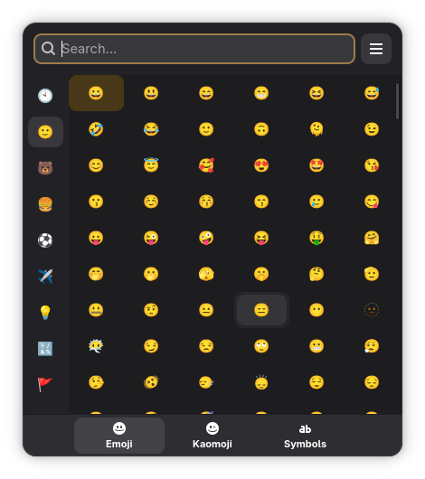

<p align="center">
  
</p>

# Carmenta

  

**Carmenta** is minimal, fast emoji picker for Linux desktops, built with Rust and GTK4. It integrates with GNOME Shell to provide instant access to Emojis, Kaomojis, Symbols, and GIFs.

<p align="center">
  
</p>

## 🚀 Performance

| Metric                | Result                              |
| :-------------------- | :---------------------------------- |
| **Startup Time**      | **< 200ms** (Internal init: ~135ms) |
| **Insertion Latency** | **~1.2ms**                          |
| **Memory Usage**      | **~0.75MB** (RSS)                   |

_Measured on standard hardware._

## ✨ Features

- **Instant Search**: Localized, debounce-optimized search for thousands of items.
- **Four Modes**:
  - 😃 **Emoji**: Full Unicode support with categories and skin tones.
  - (◕‿◕) **Kaomoji**: Extensive library of Japanese emoticons.
  - ∑ **Symbols**: Math, currency, arrows, and more.
  - 🎬 **GIFs**: Search millions of animated GIFs powered by **Klipy**.
- **Smart History**: Remembers your most used items.
- **Vim Navigation** (opt-in, `--vim`): `hjkl` to move around, `Alt`+`hjkl` to jump between the search box, categories and items.
- **"Always on Top"**: Stays visible while you work, but gets out of the way when you don't need it.
- **Shell Integration**: Uses an optional, companion GNOME Shell extension for reliable text insertion into any application (Wayland workaround).

## 📦 Installation

### Fedora (Recommended)

You can install Carmenta directly from the [COPR repository](https://copr.fedorainfracloud.org/coprs/szymon-wilczek/carmenta/):

```bash
sudo dnf copr enable szymon-wilczek/carmenta
sudo dnf install carmenta
```

### Manual Build

If you are not using Fedora or prefer to build from source, the installation script will attempt to install necessary dependencies for you (on Ubuntu/Debian, Fedora, Arch).

If the script fails to install dependencies, you will need:

- `gtk4` (libgtk-4-dev)
- `libadwaita` (libadwaita-1-dev)
- `rust` / `cargo`

**Installation:**

1.  Clone the repository:
    ```bash
    git clone https://github.com/szymonwilczek/carmenta.git
    cd carmenta
    ```
2.  Run the installation script:
    ```bash
    ./scripts/install_app.sh
    ```

### Install Extension (Optional)

Carmenta does not require a companion extension to function correctly, but it makes the work much easier.

Currently, Wayland prohibits inserting anything from other applications into other windows.
A workaround for this is a Companion extension that communicates with the application, allowing emoticons to be inserted.

Extension can be found on [GNOME Extensions](https://extensions.gnome.org/extension/9179/carmenta/)

Manual options:

#### Installation Script

I recommend you to install the extension via [installation script](./scripts/install_extension.sh), as it do all of these (listed below - but not the 2nd step, you'll still need to do that manually):

1. Copy the `extension` folder to your GNOME Shell extensions directory:

```bash
git clone https://github.com/szymonwilczek/carmenta.git
cd carmenta
mkdir -p ~/.local/share/gnome-shell/extensions/carmenta@szymonwilczek.dev
cp -r extension/* ~/.local/share/gnome-shell/extensions/carmenta@szymonwilczek.dev/
```

2. Restart GNOME Shell (logout and login back).
3. Enable the extension using the **Extensions** app.

Obviously, if you want to do that steps yourself, that's fine and will work the same.

## ⌨️ Usage

- Launch Carmenta (can be binded to any **Custom Shortcut** as `carmenta`).
- Type to search (or use Arrows and/or Tab/Ctrl-Tab to navigate around the app).
- Click to copy & insert.
- **Esc** in the search box only leaves the box (your query stays); **Esc** anywhere else dismisses the picker, so a second **Esc** always closes it. Use **Quit** from the menu to exit the resident process.
- Prefer Vim keys? Start it as `carmenta --vim`.

### CLI options

You can launch Carmenta with runtime configuration:

```bash
carmenta --width 420 --height 480
```

Available options:

- `--width <px>` - fixed window width, range: `280..=1400`
- `--height <px>` - fixed window height, range: `320..=1400`
- `--disable-gifs` - hides GIF tab (can improve performance and lower network usage)
- `--close-on-select` - dismiss the window automatically after picking an item
- `--prewarm` - start resident in the background without showing the window (warms render caches so the first invocation is instant)
- `--vim` - enable Vim-style `hjkl` navigation (see [Vim navigation](#-vim-navigation))
- `--scale <factor>` - UI scale multiplier for emoji/kaomoji/symbols/GIFs (e.g. `1.25` = 125%), range: `0.5..=4.0`

> Carmenta stays resident after first launch and hides instead of quitting, so
> subsequent invocations re-show instantly. The GNOME Shell extension launches
> a `--prewarm` instance at login, so even the first pick is fast. Runtime
> options (`--width`, `--close-on-select`, …) are applied on each CLI
> invocation and update the resident window before it is shown.

Examples:

```bash
# Smaller, fixed window
carmenta --width 320 --height 380

# Performance mode (without GIF tab)
carmenta --disable-gifs

# Both combined
carmenta --width 360 --height 420 --disable-gifs
```

## ⌨️ Vim navigation

Off by default. Launch with `--vim` to enable it:

```bash
carmenta --vim
```
- Carmenta always opens with the focus in the **search input**, so you can type straight away - `hjkl` there are ordinary letters.
- `Alt` + `hjkl` moves **between zones**:

| From                | Key     | Goes to                              |
| :------------------ | :------ | :----------------------------------- |
| Search input        | `Alt+l` | Menu ("About") button                |
| Menu button         | `Alt+h` | Search input                         |
| Search input / menu | `Alt+j` | Items of the currently open category |
| Items               | `Alt+k` | Search input                         |
| Items               | `Alt+h` | Categories sidebar                   |
| Categories sidebar  | `Alt+l` | Items                                |
| Categories sidebar  | `Alt+k` | Search input                         |

- Plain `hjkl` moves **inside** the focused zone: left/down/up/right through the items, or up/down through the categories (the category under the cursor opens immediately). These keystrokes never reach the search input.
- `Enter` (or `Space`) picks exactly the item under the cursor, or opens the category under the cursor.
- `Esc` still dismisses the picker, and `Ctrl+F` still jumps back to the search input.

Zone jumps that have nowhere to go (for example `Alt+h` on the GIF or search-results page, which have no sidebar) simply do nothing.

## 🪵 Debugging / logs

When Carmenta crashes (for example during `Esc`), these are the most useful places to inspect logs:

```bash
# If you run app directly from terminal
RUST_BACKTRACE=1 carmenta

# Follow user-level journal logs live
journalctl --user -f | grep -i carmenta

# Logs from current boot only
journalctl --user -b | grep -i carmenta

# Crash dumps / segfault traces
coredumpctl list | grep -i carmenta
coredumpctl info <PID_OR_EXE>
```
